# Diagram 11: Emergency Shutdown & Recovery Flow

## 🚨 Narrative

**The Scenario:** It's 2 AM. A critical vulnerability is discovered in one of the external protocols (Aave) that an Octant vault uses. The emergency admin needs to act fast to protect $10M in user funds. Here's exactly what happens during an emergency shutdown and how users can still access their funds safely.

---

## 📊 Diagram

```mermaid
sequenceDiagram
    participant Monitor as Monitoring System
    participant Admin as Emergency Admin
    participant Vault as Octant Vault
    participant Strategy1 as Aave Strategy
    participant Strategy2 as Lido Strategy
    participant Alice as Alice (User)
    participant Assets as User Assets
    
    Note over Monitor: 🚨 Critical vulnerability<br/>detected in Aave protocol
    
    Monitor->>Admin: Alert: Aave exploit detected!<br/>$10M at risk
    
    Note over Admin: Emergency admin receives<br/>alert within 30 seconds
    
    Admin->>Vault: shutdown()
    Note over Vault: Vault enters SHUTDOWN mode<br/>✅ Withdrawals: ALLOWED<br/>❌ Deposits: BLOCKED<br/>❌ New strategies: BLOCKED
    
    Vault-->>Admin: ✅ Shutdown successful
    
    Note over Admin: Now isolate the<br/>vulnerable strategy
    
    Admin->>Strategy1: emergencyWithdraw()
    Strategy1->>Strategy1: Withdraw ALL funds from Aave<br/>(may take losses if needed)
    Strategy1-->>Vault: Returns $4.5M<br/>(lost $0.5M to exploit)
    
    Note over Vault: Funds now safe in vault<br/>as idle assets
    
    Note over Strategy2: Lido strategy unaffected<br/>Continues operating normally
    
    Note over Alice: Alice hears about the issue<br/>Wants to withdraw her funds
    
    Alice->>Vault: withdraw(all shares)
    
    Vault->>Vault: Check: Is shutdown active?<br/>✅ Yes, but withdrawals allowed
    
    Vault->>Vault: Calculate Alice's share:<br/>Total: $9.5M<br/>Alice owns: 10%<br/>Alice gets: $950k
    
    Note over Vault: Alice takes proportional<br/>share of the loss:<br/>Deposited: $1M<br/>Receives: $950k<br/>Loss: $50k (5%)
    
    Vault->>Alice: Transfer $950k USDC
    
    Note over Alice: Alice successfully exited<br/>Loss minimized by quick action
    
    Note over Admin: 24 hours later...<br/>Vulnerability patched
    
    Admin->>Strategy1: Replace with patched version
    Admin->>Vault: setShutdown(false)
    
    Note over Vault: ✅ Vault reopened<br/>Normal operations resume
```



---

## 🔑 Key Points

### Emergency Powers
- **Emergency Admin Role**: Can trigger shutdown immediately without timelock
- **Shutdown Scope**: Blocks new deposits and strategy additions, but allows withdrawals
- **Strategy Isolation**: Can emergency withdraw from specific strategies
- **No User Action Required**: Users don't need to do anything unless they want to exit

### Protection Mechanisms
1. **Fast Response**: Emergency admin can act within minutes
2. **Partial Shutdown**: Can isolate one strategy while others continue
3. **User Access**: Users always retain ability to withdraw
4. **Loss Socialization**: Losses are shared proportionally among all users

### Recovery Process
1. **Immediate**: Trigger shutdown and isolate vulnerable strategy
2. **Assessment**: Calculate actual losses and remaining assets
3. **Communication**: Notify users about the situation
4. **Resolution**: Fix the issue or migrate to new strategy
5. **Reopening**: Remove shutdown mode when safe

### User Impact
- **Existing Deposits**: Safe, can withdraw at any time
- **New Deposits**: Blocked until issue resolved
- **Losses**: Shared proportionally based on share ownership
- **Yield**: Paused during shutdown period

### Best Practices
- **Monitoring**: 24/7 automated monitoring of all integrated protocols
- **Multi-Sig**: Emergency admin role held by multi-sig for security
- **Communication**: Immediate public disclosure of issues
- **Testing**: Regular emergency drill testing

---

## 🎯 Common Scenarios

### Scenario 1: Single Strategy Compromise
- **Action**: Emergency withdraw from affected strategy only
- **Impact**: Other strategies continue operating
- **User Access**: Full withdrawal capability maintained

### Scenario 2: Vault-Level Issue
- **Action**: Complete vault shutdown
- **Impact**: All strategies pause, withdrawals only
- **User Access**: Emergency withdrawal mode activated

### Scenario 3: False Alarm
- **Action**: Shutdown triggered out of caution
- **Impact**: Minimal, vault reopened within hours
- **User Access**: Withdrawals never blocked

---

## 💡 Technical Details

### Shutdown State Machine

```
Normal Operation
    ↓ (shutdown() called)
Shutdown Mode
    ↓ (emergencyWithdraw() called)
Funds Secured
    ↓ (assessment complete)
Recovery Plan
    ↓ (issue fixed)
Reopened
```

### Access Control

| Function | Normal | Shutdown |
|----------|--------|----------|
| `deposit()` | ✅ | ❌ |
| `withdraw()` | ✅ | ✅ |
| `addStrategy()` | ✅ | ❌ |
| `updateDebt()` | ✅ | ❌ |
| `report()` | ✅ | ❌ |
| `emergencyWithdraw()` | ❌ | ✅ |

### Key Functions

```solidity
// Emergency admin triggers shutdown
function shutdown() external onlyEmergencyAdmin {
    isShutdown = true;
    emit VaultShutdown(block.timestamp);
}

// Emergency withdraw from strategy
function emergencyWithdraw(address strategy) external onlyEmergencyAdmin {
    IStrategy(strategy).emergencyWithdraw(type(uint256).max);
}

// Reopen after issue resolved
function setShutdown(bool _shutdown) external onlyEmergencyAdmin {
    isShutdown = _shutdown;
    emit ShutdownStatusChanged(_shutdown);
}
```

---

## 📚 Related Topics

- **[Loss Scenario & Protection](./12-loss-scenario.md)** - How losses are handled in detail
- **[Access Control & Roles](../3-governance-allocation/13-access-control.md)** - Who can do what
- **[Withdrawal Queue](../7-operations-edge-cases/17-withdrawal-queue.md)** - How withdrawals are processed

---

## 🔗 Smart Contract References

- `MultistrategyVault.sol`: Main shutdown logic
- `BaseStrategy.sol`: Emergency withdraw implementation
- `Roles.sol`: Access control for emergency functions

---

**Status:** ✅ Complete  
**Last Updated:** November 2024  
**Part of:** Octant v2 Diagram Tutorial


