# Diagram 12: Loss Scenario & Protection

## 📉 Narrative

**The Scenario:** An Octant vault has $1M deployed across strategies. One strategy (Morpho) suffers a 30% loss due to a bad debt event. The vault has $200k in that strategy. Here's how Octant protects users and where the Dragon Router's donated yield shares act as a buffer.

---

## 📊 Diagram

```mermaid
flowchart TD
    Start[🏦 Vault State Before Loss<br/>Total Assets: $1M<br/>User Shares: 1M<br/>Dragon Router Shares: 100k]
    
    Start --> Strategies[Strategy Breakdown]
    
    Strategies --> S1[Aave: $500k ✅]
    Strategies --> S2[Lido: $300k ✅]
    Strategies --> S3[Morpho: $200k ⚠️]
    
    S3 --> Loss[💥 LOSS EVENT<br/>Morpho Protocol Bad Debt<br/>Strategy loses 30%]
    
    Loss --> Calc[Loss Calculation<br/>$200k → $140k<br/>Loss: $60k]
    
    Calc --> Decision{How to handle $60k loss?}
    
    Decision -->|Step 1| CheckBuffer[Check Dragon Router Buffer<br/>Router has 100k shares<br/>= ~$91k value at current PPS]
    
    CheckBuffer --> BurnShares[🔥 Burn Router Shares First<br/>Burn 66k shares ≈ $60k<br/>Router shares: 100k → 34k]
    
    BurnShares --> Recalc[Recalculate Share Price<br/>Total Assets: $940k<br/>Total Shares: 1,034k<br/>New PPS: $0.909]
    
    Recalc --> Impact[Impact Assessment]
    
    Impact --> UserImpact[👤 User Impact:<br/>Alice had: 10k shares<br/>Before: $10k value<br/>After: $9,090 value<br/>Loss: $910 9.1%]
    
    Impact --> RouterImpact[🐉 Dragon Router Impact:<br/>Had: 100k shares $91k<br/>Burned: 66k shares<br/>Remaining: 34k shares $31k<br/>Absorbed: $60k of loss]
    
    UserImpact --> Protection[🛡️ Protection Achieved<br/>Router buffer absorbed most loss<br/>Users protected partially]
    
    RouterImpact --> Protection
    
    Protection --> Future[📈 Future Yield Rebuilds Buffer<br/>New yield → New router shares<br/>Buffer regenerates over time]
    
    style Loss fill:#ff6b6b
    style BurnShares fill:#ffd93d
    style Protection fill:#6bcf7f
```



---

## 🔑 Key Points

### Loss Protection Hierarchy

**Priority Order:**
1. **Dragon Router Shares** (First Loss Protection)
   - Donated yield shares burned first
   - Acts as a cushion for users
   - Can absorb losses up to router's share balance

2. **User Shares** (Proportional Loss)
   - If loss exceeds router buffer, users take proportional hit
   - Loss distributed equally per share
   - No user is prioritized over another

### Dragon Router as Buffer

**How It Works:**
- Users deposit → receive shares
- Strategies earn yield → router receives yield shares
- Loss occurs → router shares burned first
- Users protected up to the router's share balance

**Example:**
```
Vault: $1M total
User shares: 900k (90%)
Router shares: 100k (10%)

$50k loss occurs:
1. Burn router shares worth $50k
2. Router absorbs entire loss
3. Users unaffected ✅

$150k loss occurs:
1. Burn all router shares ($100k)
2. Remaining $50k loss → users
3. Users lose 5.6% proportionally
```

### Share Price Mechanics

**Before Loss:**
```
Total Assets: $1,000,000
Total Shares: 1,100,000 (1M user + 100k router)
Price Per Share: $0.909
```

**After $60k Loss (Router Covers $60k):**
```
Total Assets: $940,000
Total Shares: 1,034,000 (1M user + 34k router)
Price Per Share: $0.909 (unchanged for users!)
```

**After $160k Loss (Router + Users):**
```
Total Assets: $840,000
Total Shares: 1,000,000 (router depleted)
Price Per Share: $0.840 (users take 16% loss)
```

### Loss Scenarios

| Loss Amount | Router Buffer | User Impact | Router Impact |
|-------------|---------------|-------------|---------------|
| $50k | $100k | 0% loss ✅ | -$50k |
| $100k | $100k | 0% loss ✅ | -$100k (depleted) |
| $150k | $100k | -5.6% | -$100k (depleted) |
| $200k | $100k | -11.1% | -$100k (depleted) |

---

## 📈 Mathematical Example

### Initial State
```
Total Deployed: $1,000,000
- Aave: $500,000
- Lido: $300,000  
- Morpho: $200,000

Share Distribution:
- User shares: 1,000,000
- Router shares: 100,000
- Total shares: 1,100,000

Price Per Share: $1,000,000 / 1,100,000 = $0.909
```

### Loss Event
```
Morpho loses 30%
$200,000 → $140,000
Loss: $60,000

New Total: $940,000
```

### Protection Calculation
```
Step 1: Assess Router Buffer
Router Shares: 100,000
Router Value: 100,000 × $0.909 = $90,900
Buffer Available: $90,900 ✅ (exceeds $60k loss)

Step 2: Calculate Shares to Burn
Loss: $60,000
PPS: $0.909
Shares to burn: $60,000 / $0.909 = 65,984 shares

Step 3: Burn Router Shares
Router shares: 100,000 → 34,016
Total shares: 1,100,000 → 1,034,016

Step 4: Recalculate PPS
New PPS: $940,000 / 1,034,016 = $0.909
(Unchanged for users! ✅)
```

### User Impact
```
Alice's Position:
- Shares: 10,000 (unchanged)
- Before: 10,000 × $0.909 = $9,090
- After: 10,000 × $0.909 = $9,090
- Loss: $0 ✅ (Router absorbed it!)
```

---

## 🔄 Loss Recovery Process


---

## 🛡️ Protection Limits

### When Protection Works
✅ Small losses (<10% of router buffer)  
✅ Single strategy failures  
✅ Temporary market volatility  
✅ Exploits caught early

### When Users Take Losses
⚠️ Catastrophic losses (>router buffer)  
⚠️ Multiple simultaneous failures  
⚠️ Extended market crashes  
⚠️ Protocol-wide exploits

### Buffer Regeneration
- **Source**: Future yield from strategies
- **Rate**: Depends on yield rate and donation %
- **Target**: Maintain 10-20% buffer relative to TVL
- **Monitoring**: Track buffer health continuously

---

## 💡 Real-World Example

### Case Study: March 2024 Hypothetical

**Setup:**
- Vault TVL: $5M
- Router buffer: $500k (10%)
- Morpho strategy: $1M deployed

**Event:**
- Morpho suffers $300k bad debt
- Loss: 30% of strategy, 6% of total TVL

**Response:**
1. Keeper detects loss in next report cycle
2. Vault burns router shares worth $300k
3. Router buffer: $500k → $200k
4. User shares: Unchanged value ✅
5. PPS impact: Minimal (<0.1% due to rounding)

**Recovery:**
- Next 6 months: $400k total yield earned
- 50% donation = $200k to router
- Router buffer: $200k → $400k
- Buffer restored to 8% of TVL

---

## 🎯 Strategy Selection Impact

Different strategies have different risk profiles:

| Strategy | Risk Level | Buffer Recommendation |
|----------|------------|----------------------|
| Aave USDC | Low | 5-10% buffer |
| Lido Staking | Low-Medium | 5-10% buffer |
| Morpho | Medium | 10-15% buffer |
| Volatile Farms | High | 15-25% buffer |

**Rule of Thumb:**
- Higher risk → Larger buffer needed
- Diversification reduces risk
- Monitor buffer health weekly

---

## 📚 Related Topics

- **[Emergency Shutdown](./11-emergency-shutdown.md)** - Handling critical vulnerabilities
- **[Yield Donating Strategy](../../octant-v2-visual-guide.md#diagram-4-yield-donating-strategy-discrete-profits)** - How router accumulates shares
- **[Debt Management](../../octant-v2-visual-guide.md#diagram-3-multi-strategy-vault-allocation)** - Strategy allocation

---

## 🔗 Smart Contract References

- `MultistrategyVault.sol`: Loss calculation and share burning
- `YieldDonatingTokenizedStrategy.sol`: Router share management
- `DebtManagementLib.sol`: Loss assessment logic

---

**Status:** ✅ Complete  
**Last Updated:** November 2024  
**Part of:** Octant v2 Diagram Tutorial


