# Diagram 15: Strategy Reporting & Harvest Cycle

## 🔄 Narrative

**The Scenario:** A keeper bot monitors an Aave lending strategy. It's been 24 hours since the last harvest, and the strategy has earned $500 in interest. The keeper triggers a harvest. Let's follow the complete flow from trigger to yield distribution.

---

## 📊 Diagram

```mermaid
sequenceDiagram
    participant Keeper as Keeper Bot
    participant Strategy as Aave Strategy
    participant Aave as Aave Protocol
    participant Vault as Octant Vault
    participant Router as Dragon Router
    participant Events as Event Logs
    
    Note over Keeper: Monitoring loop running<br/>Checks every 5 minutes
    
    Keeper->>Strategy: harvestTrigger()
    Strategy->>Strategy: Check conditions:<br/>1. Time since last report > 24h ✅<br/>2. Idle funds > 0 ❌<br/>3. Manual trigger ❌
    Strategy-->>Keeper: Returns: true ✅
    
    Note over Keeper: Harvest is due!<br/>Prepare transaction
    
    Keeper->>Strategy: report()
    Note over Strategy: HARVEST BEGINS
    
    Strategy->>Strategy: _harvestAndReport()
    
    Strategy->>Aave: Check current balance
    Aave-->>Strategy: aUSDC balance: 100,500<br/>(100k principal + 500 interest)
    
    Strategy->>Strategy: Calculate profit:<br/>Current: 100,500<br/>Last report: 100,000<br/>Profit: 500 USDC ✅
    
    Strategy->>Aave: Claim any pending rewards
    Note over Aave: No additional rewards<br/>Interest already accrued
    
    Strategy->>Strategy: Update internal accounting:<br/>totalAssets = 100,500<br/>totalDebt = 100,000<br/>profit = 500
    
    Note over Strategy: Now distribute profit<br/>to Dragon Router
    
    Strategy->>Strategy: convertToShares(500 USDC)<br/>= 500 shares<br/>(assuming 1:1 ratio)
    
    Strategy->>Router: Mint 500 new shares
    Note over Router: Router now has:<br/>500 more shares<br/>representing the profit
    
    Router-->>Strategy: Shares minted ✅
    
    Strategy->>Strategy: Update lastReport timestamp<br/>lastReport = now
    
    Strategy->>Events: Emit Harvested event<br/>profit: 500 USDC<br/>timestamp: now
    
    Strategy-->>Keeper: Report complete ✅<br/>Gas used: ~150k
    
    Note over Keeper: Transaction successful!<br/>Profit sent to router<br/>Schedule next check
    
    Note over Events: Event captured by<br/>subgraph & monitoring
    
    Events->>Keeper: Index event for analytics
```



---

## 🔑 Key Points

### Harvest Triggers

Three conditions can trigger a harvest:

1. **Time-Based** (Most Common)
   - `block.timestamp - lastReport >= maxReportDelay`
   - Typically: 24 hours for stable strategies, 12 hours for volatile ones
   - Ensures regular profit realization

2. **Idle Funds**
   - Strategy holds undeployed assets
   - `asset.balanceOf(strategy) > 0`
   - Prompts redeployment to earn yield

3. **Manual Trigger**
   - Management or keeper calls `report()` directly
   - Used for emergency updates or rebalancing

### Harvest Process Steps

```
1. Check Trigger → Are conditions met?
2. Calculate Profit → Compare current vs last report
3. Claim Rewards → Collect any protocol tokens
4. Update Accounting → Record new state
5. Distribute Yield → Mint shares to Dragon Router
6. Update Timestamp → Record harvest time
7. Emit Events → Log for monitoring
```

### Profit Calculation

**Formula:**
```solidity
uint256 currentAssets = totalAssets(); // Current balance in protocol
uint256 profit = currentAssets > totalDebt ? currentAssets - totalDebt : 0;
uint256 loss = currentAssets < totalDebt ? totalDebt - currentAssets : 0;
```

**Example:**
```
Last Report:
- totalDebt: 100,000 USDC
- totalAssets: 100,000 USDC

Current State (24h later):
- totalAssets: 100,500 USDC (earned 500)

Calculation:
- profit = 100,500 - 100,000 = 500 USDC ✅
- loss = 0 ✅
```

### Share Minting for Yield

When profit is detected:

**Yield Donating Strategy:**
```solidity
// Mint shares equal to profit amount
uint256 shares = convertToShares(profit);
_mint(dragonRouter, shares);
```

**Yield Skimming Strategy:**
```solidity
// Mint shares representing appreciation
uint256 shares = (profit * totalSupply) / (totalAssets - profit);
_mint(dragonRouter, shares);
```

---

## ⏱️ Timing & Frequency

### Typical Harvest Schedules

| Strategy Type | Harvest Frequency | Reason |
|--------------|-------------------|---------|
| Aave Lending | 24 hours | Steady, predictable yield |
| Lido Staking | 24 hours | Daily rebase |
| Morpho | 12 hours | More volatile rates |
| Farming | 6-12 hours | Token rewards accumulate |
| Volatile DeFi | 4-8 hours | Rapid rate changes |

### Gas Considerations

**Average Gas Usage:**
- Simple report: 80k - 120k gas
- With reward claiming: 150k - 200k gas
- Complex strategies: 200k - 300k gas

**Cost-Benefit Analysis:**
```
Example at 0.1 gwei gas price:
- Harvest cost: ~$1.50
- Profit earned: $500
- Net benefit: $498.50 ✅

If profit < $10:
- Harvest may not be economical
- Wait for more profit to accumulate
```

---

## 🔄 Complete Harvest Flow


---

## 💰 Profit Distribution Example

### Scenario: $1000 Profit from Multiple Sources

**Step 1: Aggregate Profit**
```
Aave Interest: $600
Morpho Yield: $300
Swap Profits: $100
Total: $1000
```

**Step 2: Convert to Shares**
```
Current PPS: $1.00
Shares to mint: 1000 / 1.00 = 1000 shares
```

**Step 3: Mint to Router**
```
Before:
- Total Shares: 100,000
- Router Shares: 5,000

After:
- Total Shares: 101,000
- Router Shares: 6,000
```

**Step 4: Update Accounting**
```
totalAssets: 100,000 → 101,000
totalDebt: 100,000 (unchanged)
lastReport: timestamp updated
```

---

## 🤖 Keeper Bot Logic

### Pseudocode

```python
def harvest_loop():
    while True:
        # Check all strategies
        for strategy in strategies:
            # Check if harvest is due
            should_harvest = strategy.harvestTrigger()
            
            if should_harvest:
                # Simulate transaction
                estimated_gas = simulate_harvest(strategy)
                estimated_cost = estimated_gas * gas_price
                
                # Check if economical
                expected_profit = strategy.expectedProfit()
                
                if expected_profit > estimated_cost * 2:  # 2x buffer
                    # Execute harvest
                    try:
                        tx = strategy.report()
                        log_success(tx)
                    except Exception as e:
                        log_error(e)
                        alert_team(e)
                else:
                    log_skip("Not economical yet")
        
        # Wait before next check
        sleep(300)  # 5 minutes
```

### Error Handling

**Common Errors:**
1. **Out of Gas** → Increase gas limit
2. **Revert: "Harvest too early"** → Wait longer
3. **Revert: "No profit"** → Skip this cycle
4. **Protocol Paused** → Wait for resume
5. **Slippage Too High** → Adjust slippage tolerance

---

## 📊 Monitoring & Alerts

### Key Metrics to Track

1. **Harvest Frequency**
   - Target: Every 24 hours
   - Alert if: >36 hours since last harvest

2. **Profit Per Harvest**
   - Track average profit
   - Alert if: Significant deviation

3. **Gas Efficiency**
   - Track cost per harvest
   - Alert if: Cost > 10% of profit

4. **Failure Rate**
   - Track failed harvests
   - Alert if: >5% failure rate

### Dashboard Example

```
Strategy: Aave USDC Lending
├─ Last Harvest: 12 hours ago ✅
├─ Expected Profit: $450
├─ Estimated Gas: $1.20
├─ Net Profit: $448.80
├─ Harvest Due In: 12 hours
└─ Status: Healthy ✅

Strategy: Lido ETH Staking
├─ Last Harvest: 26 hours ago ⚠️
├─ Expected Profit: $1,200
├─ Estimated Gas: $2.50
├─ Net Profit: $1,197.50
├─ Harvest Due In: OVERDUE ⚠️
└─ Status: Action Required
```

---

## 🔧 Advanced Topics

### Batch Harvesting

Harvest multiple strategies in one transaction:

```solidity
function batchHarvest(address[] calldata strategies) external {
    for (uint i = 0; i < strategies.length; i++) {
        if (IStrategy(strategies[i]).harvestTrigger()) {
            IStrategy(strategies[i]).report();
        }
    }
}
```

**Benefits:**
- Save gas on transaction overhead
- Coordinate harvests
- Simplify keeper logic

### Conditional Harvesting

Advanced trigger logic:

```solidity
function harvestTrigger() external view returns (bool) {
    // Time-based
    if (block.timestamp - lastReport >= maxReportDelay) {
        return true;
    }
    
    // Profit threshold
    if (expectedProfit() >= minProfitThreshold) {
        return true;
    }
    
    // Market conditions
    if (isVolatilityHigh() && timeSinceLastReport > 4 hours) {
        return true;
    }
    
    return false;
}
```

---

## 📚 Related Topics

- **[Yield Donating Strategy](../../octant-v2-visual-guide.md#diagram-4-yield-donating-strategy-discrete-profits)** - How profit becomes shares
- **[Loss Scenario](../1-core-concepts/12-loss-scenario.md)** - Handling negative reports
- **[Health Monitoring](../7-operations-edge-cases/36-health-monitoring.md)** - Keeper infrastructure

---

## 🔗 Smart Contract References

- `BaseStrategy.sol`: `harvestTrigger()` and `_harvestAndReport()`
- `YieldDonatingTokenizedStrategy.sol`: Share minting logic
- `DragonRouter.sol`: Yield receiver

---

**Status:** ✅ Complete  
**Last Updated:** November 2024  
**Part of:** Octant v2 Diagram Tutorial


