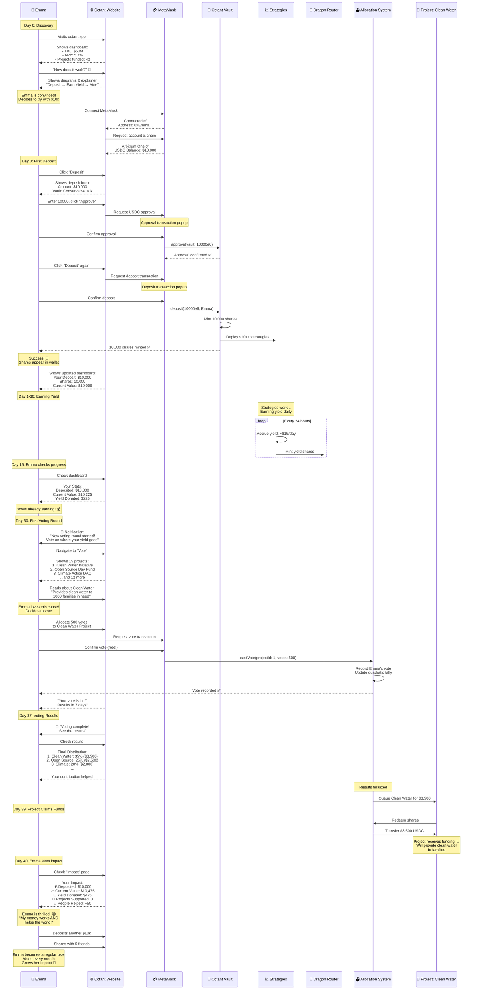

# Diagram 27: First-Time User Complete Journey

## 🎉 Narrative

**The Scenario:** Meet Emma. She just heard about Octant and wants to put her $10,000 USDC to work while supporting public goods. This is her complete journey from first website visit to casting her first vote 30 days later.

---

## 📊 Diagram



---

## 🔑 Key Points

### User Journey Phases

**Phase 1: Discovery (Day 0)**
- Learn about Octant
- Understand the value proposition
- See real impact metrics

**Phase 2: Onboarding (Day 0)**
- Connect wallet
- Approve token
- Make first deposit

**Phase 3: Earning (Days 1-30)**
- Passive yield generation
- Monitor balance growth
- Learn about voting

**Phase 4: Participation (Day 30+)**
- Vote on projects
- See impact
- Become community member

**Phase 5: Advocacy (Day 40+)**
- Deposit more
- Share with friends
- Regular participation

### Time Investment

| Activity | Time Required | Frequency |
|----------|--------------|-----------|
| Initial learning | 15-30 min | Once |
| First deposit | 5 min | Once |
| Check balance | 1 min | Weekly |
| Vote | 10-15 min | Monthly |
| Share & discuss | Variable | Ongoing |

---

## 💭 Emma's Thoughts Throughout

### Day 0: "Is this legit?"
- **Concern**: Too good to be true?
- **Resolution**: Sees audits, TVL, established protocol
- **Outcome**: Decides to try with portion of savings

### Day 1: "Did it work?"
- **Check**: Looks at wallet - sees shares ✅
- **Check**: Dashboard shows deposit ✅
- **Feeling**: Excited but cautious

### Day 7: "Am I earning?"
- **Check**: Balance is $10,095
- **Reaction**: "It's working! 🎉"
- **Action**: Tells partner about it

### Day 15: "Where's my yield going?"
- **Realizes**: Yield is donated, not kept
- **Thought**: "Oh right, that's the point!"
- **Feeling**: Proud to support projects

### Day 30: "I get to vote?"
- **Reaction**: "This is democratic! Love it!"
- **Action**: Spends time reading about projects
- **Outcome**: Votes with conviction

### Day 40: "I made an impact!"
- **Sees**: Real projects funded with her yield
- **Realizes**: Sustained funding model works
- **Decision**: Deposits more, becomes advocate

---

## 📱 User Interface Touchpoints

### Homepage
```
┌─────────────────────────────────────┐
│  💰 Octant - Sustainable Funding    │
├─────────────────────────────────────┤
│  Put your crypto to work for good   │
│                                     │
│  [Connect Wallet]                   │
│                                     │
│  📊 Live Stats:                      │
│  • TVL: $50M                        │
│  • Projects Funded: 42              │
│  • Monthly Yield: $200k             │
└─────────────────────────────────────┘
```

### Dashboard (After Deposit)
```
┌─────────────────────────────────────┐
│  Your Portfolio                     │
├─────────────────────────────────────┤
│  Balance: $10,475                   │
│  Deposited: $10,000                 │
│  Yield Donated: $475                │
│                                     │
│  [Deposit More]  [Withdraw]         │
│                                     │
│  📊 Allocation:                      │
│  • Aave: $6,000 (60%)              │
│  • Lido: $4,000 (40%)              │
│                                     │
│  🗳️ Next Voting: In 15 days         │
└─────────────────────────────────────┘
```

### Voting Interface
```
┌─────────────────────────────────────┐
│  Vote on Projects                   │
├─────────────────────────────────────┤
│  You have 1,000 votes               │
│  (based on your deposit)            │
│                                     │
│  🌊 Clean Water Initiative          │
│  Provides clean water to families   │
│  [ 500 votes ]  [+] [-]            │
│                                     │
│  💻 Open Source Dev Fund            │
│  Supports open source developers    │
│  [ 300 votes ]  [+] [-]            │
│                                     │
│  🌱 Climate Action DAO              │
│  Carbon offset & tree planting      │
│  [ 200 votes ]  [+] [-]            │
│                                     │
│  Remaining: 0 votes                 │
│  [Submit Votes]                     │
└─────────────────────────────────────┘
```

### Impact Page
```
┌─────────────────────────────────────┐
│  Your Impact                        │
├─────────────────────────────────────┤
│  Since joining: 40 days ago         │
│                                     │
│  💰 Financial:                       │
│  • Deposited: $10,000               │
│  • Current: $10,475 (+4.75%)       │
│  • Yield Donated: $475              │
│                                     │
│  🌱 Social:                          │
│  • Projects Supported: 3            │
│  • People Helped: ~50               │
│  • CO2 Offset: 2 tons               │
│                                     │
│  🏆 Achievements:                    │
│  ✅ First Deposit                   │
│  ✅ First Vote                      │
│  ⏳ 90-Day Streak (in progress)    │
│                                     │
│  [Share Impact] [Invite Friends]    │
└─────────────────────────────────────┘
```

---

## 🎯 Conversion Funnel

### Typical User Journey Metrics

```
100 visitors
  ↓ 40% connect wallet
40 connected
  ↓ 50% complete first deposit
20 depositors
  ↓ 80% stay active (don't withdraw)
16 retained users
  ↓ 75% vote in first round
12 engaged users
  ↓ 60% refer others
7 advocates
```

### Optimization Opportunities

1. **Discovery → Connect** (40% → 60%)
   - Better value prop
   - Trust signals
   - Video explainer

2. **Connect → Deposit** (50% → 70%)
   - Simplify UI
   - Reduce friction
   - Show calculations

3. **Deposit → Retention** (80% → 90%)
   - Regular updates
   - Show yield growth
   - Community features

4. **Retention → Voting** (75% → 85%)
   - Notifications
   - Easy UX
   - Compelling projects

---

## 🚧 Common Friction Points & Solutions

### Friction 1: "I don't understand"
**Solution:**
- Interactive tutorial
- Visual diagrams (like these!)
- Sandbox with testnet

### Friction 2: "Is it safe?"
**Solution:**
- Display audit reports
- Show TVL and track record
- Community testimonials

### Friction 3: "Too complicated"
**Solution:**
- One-click deposit
- Recommended vault presets
- Smart defaults

### Friction 4: "What if I need my money?"
**Solution:**
- Clearly show: "Withdraw anytime"
- Show withdrawal process
- Demo on testnet

### Friction 5: "Voting is overwhelming"
**Solution:**
- Project categories
- Search and filter
- Expert recommendations
- Previous round winners

---

## 📊 Success Metrics

### For Emma's Journey

| Milestone | Timing | Success Indicator |
|-----------|--------|-------------------|
| Wallet connected | Day 0 | Within 5 min of landing |
| First deposit | Day 0 | Within 15 min of connecting |
| Return visit | Day 3 | Checks balance |
| First vote | Day 30 | Participates in governance |
| Deposit increase | Day 45 | Adds more funds |
| Referral | Day 60 | Invites a friend |

### Engagement Tiers

**Tier 1: Passive User** (40% of users)
- Deposits once
- Checks occasionally
- Doesn't vote
- Satisfied with yield

**Tier 2: Active User** (35% of users)
- Deposits regularly
- Votes every round
- Monitors performance
- Emma starts here!

**Tier 3: Power User** (20% of users)
- Large deposits
- Active in community
- Provides feedback
- Creates content

**Tier 4: Advocate** (5% of users)
- Emma aspires to be here!
- Refers many users
- Community leader
- Content creator

---

## 🎁 Gamification & Retention

### Achievements System

```
🏆 Beginner
- ✅ Connect Wallet
- ✅ First Deposit
- ⏳ First Vote

🏆 Regular
- ✅ 30-Day Streak
- ⏳ $10k Deposited
- ⏳ 3 Voting Rounds

🏆 Power User
- ⏳ $50k Deposited
- ⏳ 10 Voting Rounds
- ⏳ Refer 5 Friends

🏆 Legend
- ⏳ $100k+ Deposited
- ⏳ 24+ Voting Rounds
- ⏳ Community Leader
```

### Notifications

**Week 1:**
- "Your first yield just arrived! +$35"

**Week 2:**
- "You've donated $70 so far. See your impact →"

**Week 4:**
- "Voting starts tomorrow! Get ready to vote"

**Day 30:**
- "Vote now! Your voice matters"

**Day 37:**
- "Results are in! Your votes helped fund 3 projects"

---

## 📚 Related Topics

- **[Deposit & Withdrawal](../../octant-v2-visual-guide.md#diagram-1-basic-user-deposit--withdrawal-flow)** - Technical details
- **[Quadratic Funding](../../octant-v2-visual-guide.md#diagram-7-quadratic-funding-vote--distribution)** - Voting mechanics
- **[DAO Treasury Management](./29-dao-treasury.md)** - Institutional use case (coming soon)

---

## 🔗 Resources for Users

- **Getting Started Guide**: Step-by-step walkthrough
- **Video Tutorial**: Emma's journey as 5-min video
- **FAQ**: Common questions answered
- **Discord Community**: Get help from other users

---

**Status:** ✅ Complete  
**Last Updated:** November 2024  
**Part of:** Octant v2 Diagram Tutorial


