# Diagram 17: Withdrawal Queue Processing

## 💸 Narrative

**The Scenario:** Alice wants to withdraw $50,000 from her Octant vault. The vault only has $10,000 sitting idle. The rest is deployed across 3 strategies. Here's exactly how the withdrawal queue processes her request, pulling funds from strategies in priority order.

---

## 📊 Diagram

```mermaid
sequenceDiagram
    participant Alice
    participant Vault
    participant Idle as Idle Funds
    participant S1 as Strategy 1: Aave<br/>Debt: $300k
    participant S2 as Strategy 2: Lido<br/>Debt: $200k
    participant S3 as Strategy 3: Morpho<br/>Debt: $100k
    
    Note over Vault: Vault State:<br/>Total Assets: $610k<br/>Idle: $10k<br/>Deployed: $600k
    
    Alice->>Vault: withdraw($50,000)
    
    Vault->>Vault: Convert to shares:<br/>$50k → 50,000 shares
    
    Vault->>Vault: Check Alice's balance:<br/>Has: 100,000 shares ✅<br/>Requesting: 50,000 shares ✅
    
    Note over Vault: Need: $50,000<br/>Step 1: Use idle funds
    
    Vault->>Idle: Check idle balance
    Idle-->>Vault: $10,000 available
    
    Vault->>Vault: Take $10k from idle<br/>Still need: $40k
    
    Note over Vault: Step 2: Use withdrawal queue<br/>Queue: [Aave, Lido, Morpho]
    
    Vault->>S1: Request withdraw: $40k
    
    S1->>S1: Check available liquidity<br/>Can withdraw: $40k ✅
    
    S1->>S1: _freeFunds($40k)<br/>Withdraw from Aave protocol
    
    S1->>Vault: Transfer $40k USDC
    
    Vault->>Vault: Update Strategy 1 debt:<br/>$300k → $260k
    
    Note over Vault: Collected:<br/>Idle: $10k<br/>Strategy 1: $40k<br/>Total: $50k ✅
    
    Vault->>Vault: Burn Alice's shares:<br/>100,000 → 50,000 shares
    
    Vault->>Alice: Transfer $50,000 USDC
    
    Note over Alice: ✅ Withdrawal successful!<br/>Received full amount
```



---

## 🔑 Key Points

### Withdrawal Queue Basics

**What is it?**
- Ordered list of strategies to pull from during withdrawals
- Default queue: `[Strategy1, Strategy2, Strategy3, ...]`
- Custom queue: Users can specify their own order

**Why needed?**
- Funds are deployed across strategies, not sitting idle
- Strategies may have withdrawal costs/delays
- Order matters for gas efficiency and user experience

**Queue Configuration:**
```solidity
// Default queue set by vault manager
defaultQueue = [aaveStrategy, lidoStrategy, morphoStrategy];

// Or user specifies custom queue on withdrawal
vault.withdraw(amount, receiver, owner, maxLoss, customQueue);
```

### Withdrawal Flow

```
1. Check idle funds first (cheapest)
2. If insufficient, pull from strategies in queue order
3. Stop when enough collected
4. Burn user shares
5. Transfer assets
```

### Strategy Withdrawal Limits

Each strategy has a `maxWithdraw` limit:

```solidity
function maxWithdraw(address owner) public view returns (uint256) {
    // Returns maximum that CAN be withdrawn immediately
    // May be less than total debt due to protocol limits
}
```

**Example:**
```
Strategy debt: $300k
Protocol liquidity: $280k
maxWithdraw: $280k ✅

If user wants $290k:
- Strategy withdraws $280k
- Remaining $10k from next strategy
```

---

## 🔄 Complete Withdrawal Flow Diagram


---

## 💡 Real-World Scenarios

### Scenario 1: Simple Withdrawal (Idle Funds Sufficient)

```
Alice wants: $5,000
Idle funds: $10,000

Flow:
1. Use $5k idle ✅
2. No strategy withdrawal needed
3. Fast & cheap (50k gas)
```

### Scenario 2: Single Strategy Withdrawal

```
Alice wants: $50,000
Idle funds: $10,000
Strategy 1 (Aave) can provide: $100,000

Flow:
1. Use $10k idle
2. Withdraw $40k from Aave ✅
3. Medium cost (150k gas)
```

### Scenario 3: Multi-Strategy Withdrawal

```
Alice wants: $500,000
Idle funds: $10,000
Strategy 1 max: $200,000
Strategy 2 max: $180,000
Strategy 3 max: $150,000

Flow:
1. Use $10k idle
2. Withdraw $200k from Strategy 1
3. Withdraw $180k from Strategy 2
4. Withdraw $110k from Strategy 3 ✅
5. High cost (350k gas)
```

### Scenario 4: Partial Fulfillment

```
Alice wants: $1,000,000
Available liquidity: $600,000

Flow:
1. Use all idle: $10k
2. Drain Strategy 1: $200k
3. Drain Strategy 2: $180k
4. Drain Strategy 3: $150k
5. Total: $540k
6. ❌ Revert: Cannot fulfill full amount

Solution:
- Alice withdraws $540k instead
- Or waits for more liquidity
```

---

## ⚙️ Queue Configuration

### Default Queue

Set by vault manager:

```solidity
// Set default withdrawal order
vault.setDefaultQueue([aaveStrategy, lidoStrategy, morphoStrategy]);

// Force all withdrawals to use default queue
vault.setUseDefaultQueue(true);
```

**Considerations:**
- **Liquidity**: Most liquid strategies first
- **Cost**: Cheapest withdrawal costs first
- **Safety**: Most secure strategies preferred
- **Gas**: Minimize strategy hops

### Custom Queue

Users can specify their own:

```solidity
// Alice prefers Lido first
address[] memory customQueue = new address[](2);
customQueue[0] = lidoStrategy;
customQueue[1] = aaveStrategy;

vault.withdraw(
    amount,
    receiver,
    owner,
    maxLoss,
    customQueue  // Custom queue
);
```

**Why custom?**
- Tax optimization
- Prefer specific protocols
- Avoid certain strategies
- Emergency situations

---

## 📊 Queue Management Best Practices

### For Vault Managers

1. **Order by Liquidity**
   ```
   [Highest liquidity] → [Lowest liquidity]
   ```

2. **Monitor Strategy Health**
   ```
   - Remove paused strategies from queue
   - Promote healthy strategies
   - Demote struggling strategies
   ```

3. **Gas Optimization**
   ```
   - Strategies with cheap withdrawals first
   - Avoid unnecessary hops
   - Batch updates when possible
   ```

4. **Update Regularly**
   ```
   - Review queue weekly
   - Adjust based on conditions
   - Communicate changes to users
   ```

### For Users

1. **Use Default Queue** (Usually Best)
   - Manager optimizes for everyone
   - Lower gas costs
   - Simpler logic

2. **Custom Queue** (Special Cases)
   - Urgent withdrawal (use most liquid)
   - Tax loss harvesting (choose specific strategy)
   - Avoid compromised strategy

---

## 🚨 Edge Cases & Handling

### Case 1: Strategy Paused

```
Strategy 1 is paused/shutdown

Flow:
1. Try Strategy 1 → Skip (paused)
2. Try Strategy 2 → Success ✅
3. Continue until filled
```

### Case 2: Unrealized Losses

```
Strategy has unrealized loss:
- Debt: $100k
- Value: $95k
- Loss: $5k

Alice withdraws $10k:
- Share of loss: $10k * ($5k/$100k) = $500
- Alice receives: $9,500
- Alice's loss: $500 (proportional)
```

### Case 3: Max Loss Protection

```solidity
// Alice sets maximum acceptable loss: 1%
vault.withdraw(amount, receiver, owner, 100, strategies);
// If loss > 1%, transaction reverts ✅
```

### Case 4: Withdrawal Too Large

```
Alice wants: $10M
Total liquidity: $5M

Result:
- ❌ Revert: "Insufficient liquidity"
- Solution: Withdraw in multiple transactions
- Or wait for liquidity to improve
```

---

## 📈 Gas Cost Analysis

| Scenario | Strategies Used | Gas Cost | Notes |
|----------|----------------|----------|-------|
| Idle only | 0 | ~50k | Cheapest |
| One strategy | 1 | ~150k | Typical |
| Two strategies | 2 | ~250k | Medium |
| Three strategies | 3 | ~350k | Expensive |
| Emergency | All | ~500k+ | Rare |

**Optimization Tips:**
- Keep idle buffer (5-10% of TVL)
- Use default queue (optimized by manager)
- Batch large withdrawals
- Avoid withdrawals during high gas

---

## 🔧 Advanced Features

### Auto-Allocate Integration

If vault has `autoAllocate` enabled:

```
Deposit: Automatically adds to Strategy 1
Withdraw: Follows queue normally

Benefits:
- Deposits are immediately productive
- Withdrawals respect queue order
- Simplified user experience
```

### Withdrawal Fee (If Configured)

```solidity
uint256 withdrawalFee = amount * feeRate / 10000;
uint256 netAmount = amount - withdrawalFee;

// Alice receives: netAmount
// Fee goes to: treasury or stays in vault
```

---

## 📚 Related Topics

- **[Multi-Strategy Vault](../../octant-v2-visual-guide.md#diagram-3-multi-strategy-vault-allocation)** - Strategy allocation
- **[Loss Scenario](../1-core-concepts/12-loss-scenario.md)** - Handling losses during withdrawal
- **[Failed Withdrawal](./38-failed-withdrawal.md)** - Error handling (coming soon)

---

## 🔗 Smart Contract References

- `MultistrategyVault.sol`: `_redeemStrategies()` function
- `IStrategy.sol`: `maxWithdraw()` interface
- `BaseStrategy.sol`: `_freeFunds()` implementation

---

**Status:** ✅ Complete  
**Last Updated:** November 2024  
**Part of:** Octant v2 Diagram Tutorial


