# Octant v2 Protocol: Visual Guide
## 10 Educational Diagrams

This document provides 10 comprehensive diagrams that explain the Octant v2 protocol mechanisms using step-by-step narratives.

---

## Diagram 1: Basic User Deposit & Withdrawal Flow

**Narrative:** Alice has $10,000 USDC she wants to put to work while maintaining full control of her principal.


**Key Points:**
- Alice deposits USDC and receives vault shares (like stock certificates)
- Her principal remains safe and withdrawable anytime
- The vault deploys funds to strategies that earn yield
- Alice can redeem her shares for the underlying USDC whenever she wants
- In Octant, the yield is donated to projects, not kept by Alice

---

## Diagram 2: Yield Generation & Distribution Flow

**Narrative:** Bob deposits $50,000 into an Octant vault. The vault earns yield and splits it between compounding (growing Bob's balance) and donations (funding projects).

```mermaid
flowchart TD
    A[👤 Bob Deposits $50,000 USDC] --> B[🏦 Vault Receives Deposit]
    B --> C[📈 Strategy Deploys to DeFi]
    
    C --> D1[Aave Lending Pool<br/>$30,000 @ 6% APY]
    C --> D2[Lido ETH Staking<br/>$20,000 @ 5% APY]
    
    D1 --> E[💰 Monthly Yield Generated]
    D2 --> E
    
    E --> F[Total Yield: $220/month<br/>Aave: $150 + Lido: $70]
    
    F --> G{Yield Split Decision<br/>60% Compound / 40% Donate}
    
    G -->|60% = $132| H[🔄 Compound Back to Vault<br/>Bob's balance grows]
    G -->|40% = $88| I[🎁 Donate to Dragon Router<br/>Flows to projects]
    
    H --> J[Bob's New Balance: $50,132]
    I --> K[Projects receive $88<br/>via allocation mechanism]
    
    style A fill:#e1f5ff
    style J fill:#90EE90
    style K fill:#FFD700
```



**Key Points:**
- Bob's deposit is split across multiple strategies for diversification
- Each strategy earns yield from external DeFi protocols
- Yield is split based on vault configuration (e.g., 60/40)
- Compounded portion grows Bob's principal
- Donated portion flows to projects via the Dragon Router and allocation mechanism

---

## Diagram 3: Multi-Strategy Vault Allocation

**Narrative:** Carol is a vault manager. She manages a $1M vault and decides how to allocate funds across different strategies to optimize risk and return.


**Key Points:**
- Vault manager allocates funds across multiple strategies
- Each strategy has a maximum debt limit for risk management
- Strategies invest in different DeFi protocols with varying risk/return profiles
- Some funds stay idle for quick withdrawals
- Withdrawal queue determines the order strategies are tapped when users withdraw

---

## Diagram 4: Yield Donating Strategy (Discrete Profits)

**Narrative:** A Yield Donating Strategy (like Aave lending) earns discrete profit events. The strategy mints new shares to the Dragon Router equal to the profit amount.


**Key Points:**
- Used for strategies with discrete profit events (Aave, Compound, Morpho)
- When profit is earned, new shares are minted to the Dragon Router
- Users' principal is protected - their shares represent the same USD value
- Dragon Router can redeem its shares for the donated yield
- If there's a loss, Dragon Router shares can be burned first to protect users

---

## Diagram 5: Yield Skimming Strategy (Appreciating Assets)

**Narrative:** A Yield Skimming Strategy wraps a Liquid Staking Token (LST) like mETH or stETH. As the LST appreciates, the strategy "skims" the appreciation to the Dragon Router.


**Key Points:**
- Used for liquid staking tokens (LSTs) that appreciate over time
- Strategy wraps the LST (stETH, mETH, etc.)
- As the LST appreciates, strategy "skims" the appreciation
- New shares are minted to Dragon Router representing the skimmed value
- Users' shares still represent their original principal in LST terms
- Different from Yield Donating because the underlying asset itself appreciates

---

## Diagram 6: Dragon Router & Allocation Flow

**Narrative:** The Dragon Router receives yield shares from strategies and manages the flow to allocation mechanisms where the community votes on which projects receive funding.

```mermaid
flowchart TD
    subgraph "Yield Sources"
        S1[Strategy 1: Aave<br/>Mints 100 shares]
        S2[Strategy 2: Lido<br/>Mints 75 shares]
        S3[Strategy 3: Morpho<br/>Mints 50 shares]
    end
    
    S1 --> DR[🐉 Dragon Router<br/>Accumulates yield shares]
    S2 --> DR
    S3 --> DR
    
    DR --> |Holds 225 shares total| DR2[Dragon Router Balance:<br/>225 shares from various strategies]
    
    DR2 --> AM[🗳️ Allocation Mechanism<br/>Community Voting System]
    
    subgraph "Allocation Mechanism"
        AM --> Vote[Users vote with their<br/>voting power on projects]
        Vote --> QF[Quadratic Funding<br/>Calculation]
        QF --> Dist[Distribution Phase]
    end
    
    Dist --> P1[Project A: Climate<br/>Receives 40% = 90 shares]
    Dist --> P2[Project B: Education<br/>Receives 35% = 79 shares]
    Dist --> P3[Project C: Open Source<br/>Receives 25% = 56 shares]
    
    P1 --> R1[Project redeems shares<br/>for underlying USDC]
    P2 --> R2[Project redeems shares<br/>for underlying USDC]
    P3 --> R3[Project redeems shares<br/>for underlying USDC]
    
    style DR fill:#FF6347
    style AM fill:#4169E1
    style P1 fill:#32CD32
    style P2 fill:#FFD700
    style P3 fill:#FF69B4
```



**Key Points:**
- Dragon Router is the central hub that receives all donated yield
- Multiple strategies send their yield shares to the Dragon Router
- Dragon Router interacts with allocation mechanisms
- Allocation mechanisms use voting (like quadratic funding) to distribute funds
- Projects that win votes receive shares which they can redeem for USDC/ETH
- This creates a democratic, transparent funding system

---

## Diagram 7: Quadratic Funding Vote & Distribution

**Narrative:** Three users (Alice, Bob, Carol) participate in a quadratic funding round to support projects. Small donors have proportionally more influence than large donors.

```mermaid
flowchart TD
    subgraph "Voting Phase"
        A[👤 Alice<br/>Has 100 voting power<br/>Votes: 64 to Project A<br/>36 to Project B]
        B[👤 Bob<br/>Has 400 voting power<br/>Votes: 400 to Project A]
        C[👤 Carol<br/>Has 100 voting power<br/>Votes: 100 to Project B]
    end
    
    A --> QF[📊 Quadratic Funding Formula<br/>√(sum of √contributions)]
    B --> QF
    C --> QF
    
    subgraph "Calculation for Project A"
        QF --> PA1[Project A Contributions:<br/>Alice: 64, Bob: 400]
        PA1 --> PA2[√64 + √400 = 8 + 20 = 28]
        PA2 --> PA3[28² = 784 QF score]
    end
    
    subgraph "Calculation for Project B"
        QF --> PB1[Project B Contributions:<br/>Alice: 36, Carol: 100]
        PB1 --> PB2[√36 + √100 = 6 + 10 = 16]
        PB2 --> PB3[16² = 256 QF score]
    end
    
    PA3 --> Total[Total QF Score: 1040]
    PB3 --> Total
    
    Total --> Match[Matching Pool: $10,000]
    
    Match --> PA4[Project A gets:<br/>784/1040 × $10,000 = $7,538]
    Match --> PB4[Project B gets:<br/>256/1040 × $10,000 = $2,462]
    
    style A fill:#FFB6C1
    style B fill:#87CEEB  
    style C fill:#90EE90
    style PA4 fill:#FFD700
    style PB4 fill:#FFA500
```

**Key Points:**
- Quadratic Funding amplifies the voice of many small donors
- Formula uses square root of contributions to reduce whale dominance
- Project A: Bob is a whale (400 votes) but his influence is reduced
- Project B: Two smaller donors (Alice + Carol) have collective impact
- The sum of square roots is squared to get the final QF score
- Matching pool is distributed proportionally to QF scores
- This prevents plutocracy and encourages broad community support

---

## Diagram 8: Proposal Lifecycle (Create → Vote → Queue → Redeem)

**Narrative:** A project goes through the full allocation mechanism lifecycle from proposal creation to receiving funds.


**Key Points:**
- **Pending**: Proposal submitted, waiting for voting to start
- **Active**: Voting period is open (e.g., 7 days)
- **Succeeded**: Proposal passed quorum threshold
- **Queued**: Shares allocated, timelock delay begins (e.g., 2 days)
- **Executable**: Timelock expired, project can redeem during grace period (e.g., 30 days)
- **Executed**: Project successfully redeemed shares for USDC
- **Defeated**: Did not reach quorum or receive enough votes
- **Canceled**: Proposal was canceled by owner

---

## Diagram 9: Lockup & Rage Quit Mechanism

**Narrative:** David deposits funds with a 6-month lockup for better yield. Later, he needs emergency access, so he initiates a rage quit to gradually withdraw over 3 months.


**Key Points:**
- Users can lock funds for a minimum period (e.g., 90 or 180 days)
- Lockup shows commitment and may provide benefits
- **Rage Quit** is an emergency exit mechanism
- When rage quit is initiated, user cannot deposit more
- Shares unlock linearly over 3 months (90 days)
- User can withdraw proportionally as time passes
- Formula: `unlocked = (elapsed time / 90 days) × total locked shares`
- This prevents users from being permanently trapped while maintaining some commitment period

---

## Diagram 10: Trader DCA (Dollar-Cost Averaging) Mechanism

**Narrative:** The Octant protocol needs to convert earned yield (USDC) into GLM tokens over time without creating market manipulation opportunities or giving anyone insider information about when trades happen.


**Key Points:**
- **Purpose**: Convert one token to another (e.g., USDC → GLM) gradually without market manipulation
- **Randomness**: Uses blockhash to determine if a trade can happen (no one has advance notice)
- **Budget System**: Monthly budgets and spending limits prevent over-trading
- **TWAP Oracle**: Uses Time-Weighted Average Price to prevent frontrunning and sandwiching
- **MEV Searchers**: Incentivized to execute trades but profits limited by TWAP
- **Deadlines**: Ensures budget is spent before period ends
- **Slippage Protection**: Trades revert if price moves too far from TWAP
- **No Insider Trading**: Even the deployer doesn't know when trades execute
- This is useful for DAOs/protocols that need to regularly convert tokens without giving traders unfair advantages

---

## Summary Table

| # | Diagram Name | What It Explains | Key Users |
|---|-------------|------------------|-----------|
| 1 | Basic Deposit & Withdrawal | How users interact with vaults | End Users |
| 2 | Yield Generation & Distribution | How yield is earned and split | End Users, Vault Managers |
| 3 | Multi-Strategy Vault | How vaults allocate across strategies | Vault Managers |
| 4 | Yield Donating Strategy | Discrete profit donation mechanism | Strategy Developers |
| 5 | Yield Skimming Strategy | LST appreciation capture | Strategy Developers |
| 6 | Dragon Router & Allocation | How yield flows to projects | Everyone |
| 7 | Quadratic Funding | Democratic voting system | Voters, Projects |
| 8 | Proposal Lifecycle | Project funding workflow | Projects, Governance |
| 9 | Lockup & Rage Quit | Commitment and emergency exit | Users with locked funds |
| 10 | Trader DCA | Automated token conversion | Protocol Operators |

---

## How to Use These Diagrams

**For Developers:**
- Start with Diagrams 1-3 to understand the core vault/strategy system
- Review Diagrams 4-5 to understand yield donation mechanisms
- Study Diagrams 6-8 for allocation and governance integration

**For End Users:**
- Focus on Diagrams 1, 2, 7, and 9
- These explain deposits, yield, voting, and lockups

**For Integration Partners:**
- Review Diagrams 3, 6, 8 to understand how to build on Octant
- Diagram 10 shows the DCA trading integration

**For Documentation:**
- These diagrams can be embedded in tutorials
- Each diagram has a self-contained narrative
- Mermaid syntax can be rendered in GitHub, GitBook, Docusaurus, etc.

---

## Next Steps

1. **Embed in Portal**: Add these to your documentation portal
2. **Interactive Version**: Consider adding interactive elements
3. **Video Tutorials**: Use these as storyboards for video explainers
4. **Translations**: Translate narratives to other languages
5. **User Testing**: Get feedback on which diagrams are most helpful

---

**Generated for Octant v2 Core Documentation**  
**Last Updated:** 2024  
**License:** MIT


