# Octant in 3 Minutes

## 🌊 The Big Idea

**Octant turns idle crypto into perpetual funding for projects you care about.**

Think of it like:
- A **savings account** that earns interest (your principal is safe)
- But the **interest automatically supports projects** (not just you)
- You can **withdraw your principal anytime** (complete liquidity)
- Built on **transparent blockchain rails** (fully auditable)

---

## 🎭 The Story: Alice's Journey

### **Traditional Approach (Before Octant)**

**Alice has $100,000 she wants to use for good.**

❌ **Option 1: Donate it all**
- Projects get $100,000 once
- Alice has $0 left
- No sustainable funding

❌ **Option 2: Invest and donate profits**
- Alice invests in stocks (manual, slow)
- Makes ~$5,000/year
- Manually donates quarterly
- High overhead, opaque process

---

### **With Octant (After)**

**Alice deposits $100,000 into an Octant vault.**

✅ **What Happens:**
```
1. Her $100,000 stays safe (she can withdraw anytime)
2. Vault deploys to DeFi: $60K → Aave, $40K → Lido
3. Earns ~$5,700/year automatically
4. 60% compounds ($3,420) → Alice's balance grows
5. 40% donates ($2,280) → Projects she chooses
6. Alice votes on which projects get the donated yield
```

**After 1 year:**
- Alice has: $103,420 (grew 3.42%)
- Projects received: $2,280 (and counting)
- Alice can still withdraw 100% anytime

**After 5 years:**
- Alice has: ~$118,000 (compounding growth)
- Projects received: ~$12,500 total
- Zero effort from Alice after initial setup

---

## 🏗️ The Three Core Pieces

### **1. The Vault** (Your Bank Account)

```
┌─────────────────────────────┐
│   MultistrategyVault        │
│                             │
│  Deposits: $100,000         │
│  Shares: 100,000 tokens     │
│                             │
│  User Controls:             │
│  • Deposit anytime          │
│  • Withdraw anytime         │
│  • View balance 24/7        │
└─────────────────────────────┘
```

**What it does:** 
- Holds user deposits
- Issues "shares" (like stock certificates)
- Tracks everyone's ownership
- Handles withdrawals

**Key feature:** ERC-4626 standard (like USB-C for vaults)

---

### **2. The Strategy** (Your Investment Manager)

```
┌─────────────────────────────┐
│   Yield Strategy            │
│                             │
│  Deployed: $100,000         │
│  Current: $100,475          │
│  Profit: $475 (this month)  │
│                             │
│  Invested In:               │
│  • Aave USDC Lending        │
│  • Lido ETH Staking         │
└─────────────────────────────┘
```

**What it does:**
- Takes money from vault
- Deploys to DeFi protocols
- Earns yield automatically
- Reports profits back to vault

**Key feature:** Isolated - if one strategy fails, others are safe

---

### **3. The Allocation System** (Your Giving Strategy)

```
┌─────────────────────────────┐
│   Allocation Mechanism      │
│                             │
│  This Month's Yield: $190   │
│                             │
│  Vote Results:              │
│  • Clean Water: 45% → $85.50│
│  • Open Source: 35% → $66.50│
│  • Education: 20% → $38.00  │
│                             │
│  [Projects claim funding]   │
└─────────────────────────────┘
```

**What it does:**
- Receives donated yield
- Lets community vote on projects
- Distributes funds fairly
- Prevents whale dominance (quadratic voting)

**Key feature:** Democratic - many small donors > one whale

---

## 🔄 The Complete Flow

```mermaid
graph TB
    A[👤 Alice Deposits $100K] --> B[🏦 Vault Issues Shares]
    B --> C[📈 Strategy 1: Aave<br/>$60K earning 6%]
    B --> D[📈 Strategy 2: Lido<br/>$40K earning 5%]
    
    C --> E[💰 Monthly Yield: $475]
    D --> E
    
    E --> F{Yield Split}
    F -->|60%| G[🔄 Compound Back<br/>$285 → Grows vault]
    F -->|40%| H[🎁 Donate<br/>$190 → Projects]
    
    G --> I[Alice's Balance<br/>$100,285 next month]
    H --> J[🗳️ Community Votes]
    J --> K[Projects Receive Funding]
    
    style A fill:#e1f5ff
    style I fill:#90EE90
    style K fill:#FFD700
```



---

## 🆚 Octant vs. Traditional Systems

| Feature | Traditional Finance | Typical DeFi | Octant v2 |
|---------|-------------------|-------------|-----------|
| **Principal Safety** | ✅ Yes | ⚠️ Varies | ✅ Yes |
| **Liquidity** | ⚠️ Lock-ups common | ✅ Usually instant | ✅ Instant |
| **Yield Rate** | ❌ 1-3% bonds | ✅ 4-8% lending | ✅ 5-7% blended |
| **Automation** | ❌ Manual | ⚠️ Requires actions | ✅ Fully automatic |
| **Transparency** | ❌ Quarterly reports | ⚠️ Partial | ✅ Real-time on-chain |
| **Impact Tracking** | ❌ Opaque | ❌ Not built-in | ✅ Transparent voting |
| **Customization** | ❌ One-size-fits-all | ⚠️ Technical | ✅ Modular & flexible |

---

## 🎯 Key Terms (Simple Definitions)

### **Vault**
> A smart contract that holds user deposits. Like a bank account, but on blockchain.

### **Strategy**
> Code that takes money and deploys it to earn yield. Like a robo-advisor.

### **ERC-4626**
> A standard format for vaults. Like USB-C - makes everything compatible.

### **Yield**
> The profit/interest earned. What you make on top of your principal.

### **Shares**
> Tokens representing your ownership. Like stock certificates.

### **Donating**
> Sending yield to projects instead of keeping it. Principal stays yours.

### **Quadratic Funding**
> Voting system where many small supporters > one big donor. Prevents plutocracy.

### **Allocation Mechanism**
> Contract that decides how donated yield gets distributed to projects.

---

## ❓ Common Questions

### **"Is my money safe?"**

Your principal is as safe as the DeFi protocols you choose:
- ✅ **You control withdrawals** - pull money anytime
- ✅ **Diversification** - spread across multiple strategies
- ✅ **Audited code** - Octant contracts professionally audited
- ⚠️ **Smart contract risk** - like all DeFi, code can have bugs
- ⚠️ **Protocol risk** - underlying protocols (Aave, Lido) could fail

**Risk mitigation:** Start small, use battle-tested protocols, diversify.

### **"What if I need my money back?"**

Withdraw anytime! Just call `vault.withdraw()` and funds return to your wallet in seconds.

### **"How much yield will I earn?"**

Depends on:
1. **Which protocols** you use (Aave ~6%, Lido ~4%, etc.)
2. **Market conditions** (rates fluctuate)
3. **Your split ratio** (if you donate 40%, you keep 60%)

**Typical range:** 3-7% net APY on your principal.

### **"Do I have to donate yield?"**

You choose! Octant supports:
- **100% donate** - Max impact, principal still grows from compounding
- **50/50 split** - Balance growth and impact
- **100% compound** - Pure growth (but why use Octant then?)

### **"What can I fund with the donated yield?"**

Anything with a wallet address:
- Individual developers
- Open source projects
- Nonprofits with crypto addresses
- DAOs and community treasuries
- Automated systems (via smart contracts)

---

## 🚀 Why Developers Love Octant

### **For Builders:**

✅ **Focus on strategy logic, not vault accounting**
- Octant handles share math, deposits, withdrawals
- You just implement: `deployFunds()`, `withdrawFunds()`, `harvest()`

✅ **Battle-tested foundations**
- Based on Yearn V3 (billions secured)
- ERC-4626 standard (interoperable everywhere)

✅ **Modular by design**
- Swap strategies without redeploying vaults
- Mix and match allocation mechanisms
- Extend with custom logic

✅ **Great DX (Developer Experience)**
- Clear interfaces
- Extensive documentation
- React boilerplate included
- Active Discord community

---

## 🎓 Ready to Build?

Now that you understand the concepts:

**Next Steps:**
1. [Set up your environment](#) → Install tools and clone the repo
2. [Build your first strategy](#) → Follow guided tutorial
3. [Deploy to testnet](#) → See it work live
4. [Build a frontend](#) → Let users interact

**Or explore deeper:**
- [Architecture Deep Dive](#) → Advanced technical details
- [Security Best Practices](#) → Production hardening
- [Real Examples](#) → Live Octant deployments

---

**Questions?** Ask in [Discord](https://discord.gg/octant) or continue to [Architecture Diagram](#) →

